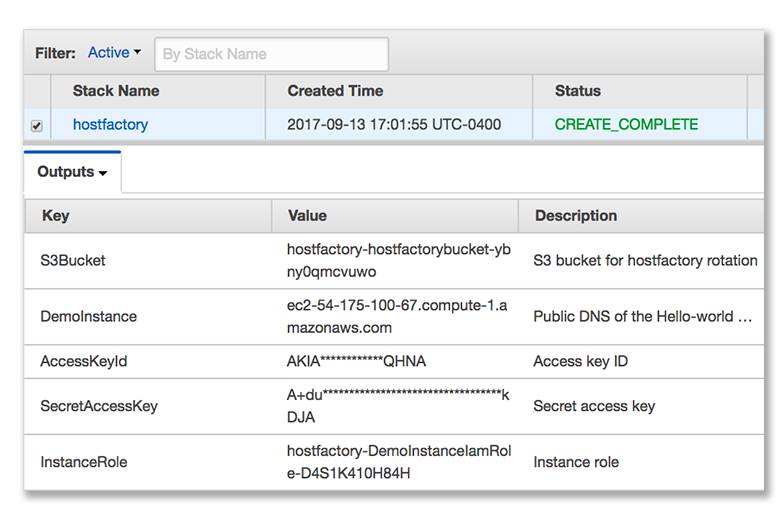

# Host-Factory Example
## Prerequisites
1. You have a Conjur instance running in EC2 (or running somewhere accessible over the internet by EC2)
2. You have the Conjur CLI installed
3. You've already run `conjur init`
4. You can run a CloudFormation template which will create IAM roles, policies an EC2 instance, S3 bucket, and security group
## Walkthrough
Begin by creating a new stack in Amazon CloudFormation using `hello-world.template`.


Once the stack has been successfully created, select it, and view the `Outputs` tab



We will be coming back to the `Outputs` tab for information throughout the walkthrough, so be sure to keep it open. Open `policy/hello-world.yml` with your favorite text editor. Replace the comment for `rotation/target/s3/role-name` with the value of `InstanceRole` from the CloudFormation stack output. Similarly, replace the comment for `rotation/target/s3/bucket` with the value of `S3Bucket` from the CloudFormation stack output.

Save the file.

Next, we'll load our edited policy into Conjur. Log in as `admin` (or a `security_admin`) and run the following:
```
$ conjur authn login admin
$ conjur policy load --as-group security_admin policy/Conjurfile
```

Log into the UI and fill out all the newly create variables we've loaded with the exception of `hello-world/s3/host-factory-token`. This variable will be auto-populated by a rotator.


Now we can kick off a manual rotation for our host factory token, allowing the EC2 instance created as part of the stack to register.

```
$ conjur variable expire -n hello-world/s3/host-factory-token
{
  "id": "hello-world/s3/host-factory-token",
  "resource_identifier": "demo:variable:hello-world/s3/host-factory-token",
  "expiration/timestamp": "2017-09-13T21:06:37Z"
}
```

The rotator will also update a file in S3 which our instance has explicit permission to read. Upon it's creation, the instance will automatically fetch the host factory token and enroll itself to Conjur using a UserData script. After the rotation has occurred, you can refresh the Dashboard page in the UI to see a new host enrolled and retrieving secrets. If you visit the Public DNS or IP of this instance in your browser, you'll see a page printing the secrets it was able to retrieve. 

